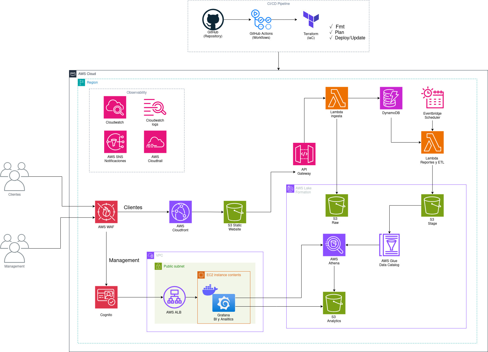

# 🚚 SendFast Analytics

[](https://aws.amazon.com/)
[](https://www.terraform.io/)
[](https://vite.dev/)
[](https://www.python.org/)
[](https://grafana.com/)

**SendFast Analytics** es una arquitectura cloud para una startup de domicilios que necesita capturar pedidos, procesarlos en un data lake y convertirlos en métricas de negocio para tableros ejecutivos. El repositorio queda preparado como proyecto de portafolio: infraestructura como código, despliegue automatizado, frontend desacoplado, variables inyectadas desde outputs de Terraform y manejo de credenciales mediante secretos.

---

## Arquitectura final



La solución está dividida en cuatro capas principales:

1. **Canal web y seguridad:** los clientes ingresan por AWS WAF y CloudFront hacia una aplicación React publicada en un bucket S3 privado con Origin Access Control. La autenticación se realiza con Amazon Cognito y el API se protege con JWT.
2. **Ingesta transaccional:** API Gateway expone `/ingesta` y entrega los pedidos a una Lambda de ingesta. La Lambda persiste el pedido en DynamoDB y guarda el JSON crudo en S3 Raw.
3. **Procesamiento analítico:** EventBridge ejecuta periódicamente la Lambda ETL. Esta lee archivos recientes desde S3 Raw, normaliza los datos, genera Parquet y publica en S3 Stage. Glue Catalog y Athena permiten consultar los datos con SQL.
4. **Visualización y operación:** Grafana corre en EC2 con datasource de Athena provisionado por `user_data`. CloudWatch, CloudTrail y SNS quedan contemplados como capa de observabilidad para logs, auditoría y alertas.

---

## Componentes incluidos

| Capa | Servicios / tecnología | Responsabilidad |
|---|---|---|
| Frontend | React, Vite, S3 privado, CloudFront OAC | Web pública HTTPS y entrega estática segura |
| Seguridad | AWS WAF, Cognito, API Gateway JWT, IAM mínimo privilegio | Protección perimetral, autenticación, autorización y control de acceso |
| Ingesta | API Gateway HTTP, Lambda Python, DynamoDB, S3 Raw | Recepción de pedidos y almacenamiento transaccional/crudo |
| Procesamiento | EventBridge, Lambda ETL, AWS SDK for pandas, S3 Stage | Conversión JSON a Parquet y particionamiento |
| Analítica | Glue Catalog, Athena | Consulta SQL sobre el data lake |
| BI | EC2 Docker + Grafana + plugin Athena | Dashboard analítico conectado a Athena |
| CI/CD | GitHub Actions, Terraform, AWS OIDC | Validación, despliegue IaC, build web y publicación |

---

## Estructura del repositorio

```text
.
├── .github/workflows/              # Pipeline CI/CD GitHub Actions
├── docs/
│   ├── images/                     # Diagrama de arquitectura
│   └── operations/                 # Guías operativas y secretos
├── modules/                        # Módulos Terraform reutilizables
│   ├── api_gateway/
│   ├── athena/
│   ├── cloudfront_web/
│   ├── cognito/
│   ├── dynamodb/
│   ├── ec2_grafana/
│   ├── eventbridge/
│   ├── glue_catalog/
│   ├── lambda/
│   └── s3/
├── src/
│   ├── lambdas/                    # Lambdas de ingesta y ETL
│   ├── tests/                      # Generador/prueba de pedidos contra el API
│   └── web/                        # Aplicación React + Vite
├── main.tf
├── providers.tf
├── variables.tf
└── outputs.tf
```

---

## Flujo CI/CD

El workflow principal está en `.github/workflows/sendfast-ci-cd.yml` y ejecuta varios jobs separados:

| Job | Cuándo corre | Qué hace |
|---|---|---|
| `terraform_quality` | Pull request, push a `main`, manual | `terraform fmt`, `terraform init -backend=false` y `terraform validate` |
| `web_quality_build` | Pull request, push a `main`, manual | Instala dependencias, ejecuta TypeScript check y valida que la web compile |
| `terraform_deploy` | Push a `main` o ejecución manual | Configura AWS por OIDC, crea/actualiza el secreto de Grafana, ejecuta `plan/apply` y exporta `terraform output -json` |
| `web_build_deploy` | Después de Terraform | Genera `.env.production` con outputs reales, compila la web, sube `dist` al bucket S3 y limpia caché de CloudFront |

La web no guarda endpoints quemados en el código. El pipeline toma los outputs:

```text
VITE_API_URL      <- output webapp_runtime_config.VITE_API_URL
VITE_USER_POOL_ID <- output webapp_runtime_config.VITE_USER_POOL_ID
VITE_CLIENT_ID    <- output webapp_runtime_config.VITE_CLIENT_ID
```

---

## Secretos requeridos en GitHub Actions

Configura estos valores en **Settings > Secrets and variables > Actions**.

### Secrets obligatorios

| Secret | Ejemplo | Uso |
|---|---|---|
| `AWS_ROLE_TO_ASSUME` | `arn:aws:iam::123456789012:role/github-actions-sendfast` | Rol asumido por GitHub mediante OIDC |
| `TF_STATE_BUCKET` | `sendfast-analytics-terraform-state` | Bucket S3 del estado remoto |
| `TF_LOCK_TABLE` | `terraform-lock-table` | Tabla DynamoDB para bloqueo de estado |
| `TF_VAR_COGNITO_USERS` | Ver ejemplo abajo | Usuarios iniciales de Cognito |
| `GRAFANA_ADMIN_USER` | `admin` | Usuario inicial de Grafana |
| `GRAFANA_ADMIN_PASSWORD` | `********` | Contraseña inicial de Grafana |

Ejemplo para `TF_VAR_COGNITO_USERS`:

```json
{
  "admin": {
    "username": "admin_analytics",
    "email": "admin@example.com",
    "password": "ChangeThisPassword123!"
  }
}
```

### Secrets opcionales

| Secret | Ejemplo | Uso |
|---|---|---|
| `TF_VAR_ALLOWED_GRAFANA_CIDR_BLOCKS` | `["190.1.2.3/32"]` | IPs permitidas para entrar a Grafana por el puerto 3000 |
| `TF_VAR_SSH_CIDR_BLOCKS` | `["190.1.2.3/32"]` | Habilita SSH solo desde IPs específicas |
| `TF_VAR_KEY_NAME` | `sendfast-keypair` | Key Pair existente para SSH |

### Variables opcionales

| Variable | Default | Uso |
|---|---|---|
| `AWS_REGION` | `us-east-1` | Región principal del despliegue |
| `TF_STATE_KEY` | `sendfast/dev/terraform.tfstate` | Ruta del estado en el bucket |
| `GRAFANA_SECRET_NAME` | `sendfast/dev/grafana/admin` | Nombre del secreto en AWS Secrets Manager |

---

## Seguridad aplicada

- El bucket web es privado y CloudFront accede usando OAC.
- CloudFront queda asociado a AWS WAF con reglas administradas y rate limit por IP.
- El frontend no contiene URLs ni IDs de Cognito quemados; se inyectan desde outputs de Terraform en el pipeline.
- La contraseña inicial de Grafana ya no se escribe en `user_data`, Terraform ni README. GitHub Actions la guarda/actualiza en AWS Secrets Manager y EC2 la consulta al arrancar usando su instance profile.
- Grafana no queda expuesto por defecto. Para habilitarlo se debe configurar `TF_VAR_ALLOWED_GRAFANA_CIDR_BLOCKS` con CIDR específicos.
- SSH queda deshabilitado por defecto.
- S3 usa bloqueo de acceso público, versionamiento y cifrado SSE-S3.
- API Gateway usa autorizador JWT contra Cognito.

---

## Despliegue local

Para pruebas locales puedes usar un `terraform.tfvars` no versionado:

```hcl
cognito_users = {
  admin = {
    username = "admin_analytics"
    email    = "admin@example.com"
    password = "ChangeThisPassword123!"
  }
}

grafana_admin_secret_arn      = "arn:aws:secretsmanager:us-east-1:123456789012:secret:sendfast/dev/grafana/admin-AbCdEf"
allowed_grafana_cidr_blocks  = ["TU_IP_PUBLICA/32"]
ssh_cidr_blocks              = []
key_name                     = null
```

Comandos:

```bash
terraform init \
  -backend-config="bucket=<TF_STATE_BUCKET>" \
  -backend-config="key=sendfast/dev/terraform.tfstate" \
  -backend-config="region=us-east-1" \
  -backend-config="dynamodb_table=<TF_LOCK_TABLE>" \
  -backend-config="encrypt=true"

terraform fmt -recursive
terraform validate
terraform plan
terraform apply
```

---

## Ejecutar la web localmente

```bash
cd src/web
cp .env.example .env.local
npm install
npm run dev
```

Para compilar con valores reales después de Terraform:

```bash
terraform output -json > tfoutputs.json
cat > src/web/.env.production <<EOF_ENV
VITE_API_URL=$(jq -r '.webapp_runtime_config.value.VITE_API_URL' tfoutputs.json)
VITE_USER_POOL_ID=$(jq -r '.webapp_runtime_config.value.VITE_USER_POOL_ID' tfoutputs.json)
VITE_CLIENT_ID=$(jq -r '.webapp_runtime_config.value.VITE_CLIENT_ID' tfoutputs.json)
EOF_ENV

cd src/web
npm run build
```

---

## Generar datos de prueba

El script de prueba no contiene endpoints ni contraseñas quemadas. Exporta los valores desde los outputs y tus secretos locales:

```bash
export API_URL=$(terraform output -raw api_ingesta_url)
export AWS_REGION=us-east-1
export USER_POOL_ID=$(terraform output -raw cognito_user_pool_id)
export CLIENT_ID=$(terraform output -raw cognito_client_id)
export COGNITO_USERNAME=admin_analytics
export COGNITO_PASSWORD='********'
export TOTAL_ORDERS=200
export ORDERS_PER_BATCH=20

python src/tests/test_ingesta.py
```

---

## Decisiones de arquitectura

- **Serverless first:** Lambda, API Gateway, DynamoDB, S3, Glue y Athena reducen operación y permiten pagar por uso.
- **Data lake por capas:** Raw conserva el evento original y Stage contiene Parquet consultable por Athena.
- **Frontend desacoplado:** Terraform crea infraestructura; GitHub Actions compila y publica la web con configuración runtime generada desde outputs.
- **Secretos fuera del código:** GitHub Secrets y AWS Secrets Manager evitan credenciales hardcodeadas en `user_data` y archivos versionados.
- **Observabilidad preparada:** CloudWatch Logs, CloudTrail y SNS quedan como base para alertas operativas y auditoría.

---

## Roadmap recomendado

- Extender AWS WAF también a API Gateway si se requiere protección regional adicional.
- Publicar Grafana detrás de ALB + HTTPS con ACM y dominio propio.
- Migrar usuarios iniciales de Cognito a un proceso de bootstrap externo para evitar contraseñas en Terraform state.
- Añadir pruebas unitarias de Lambdas con mocks de boto3.
- Versionar `package-lock.json` para builds 100% determinísticos.
